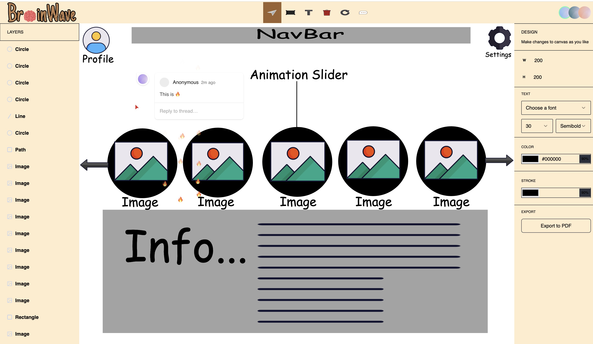

# Brain Wave 🧠

Brain Wave is a collaborative design tool similar to Figma, built using Next.js 14 and TypeScript. It integrates Liveblocks for real-time collaboration, offering features such as cursor chat, comments, reactions, and the ability to draw designs on the canvas using Fabric.js.

## Features

- ⚡️ **Real-time Collaboration:** Brain Wave allows multiple users to collaborate on designs simultaneously, providing a seamless and interactive experience.
  
- 💬 **Cursor Chat:** Users can communicate with each other in real-time through cursor chat, enhancing collaboration and communication during design sessions.
  
- 💡 **Comments and Reactions:** Brain Wave enables users to leave comments and reactions on specific design elements, facilitating feedback and iteration.
  
- 🎨 **Drawing Designs:** Users can draw shapes and upload images directly onto the canvas using Fabric.js, providing flexibility and creativity in design creation.
  
- ↩️ **Undo/Redo:** The application supports undo and redo functionality, allowing users to revert changes and revisit previous iterations of their designs.

## Technologies Used

- 🚀 **Next.js 14:** Brain Wave is built using Next.js, a React framework renowned for its performance and developer experience.
  
- 🧰 **TypeScript:** TypeScript is employed for static typing, enhancing code quality and maintainability.
  
- 🌐 **Liveblocks:** Liveblocks powers the real-time collaboration features, enabling seamless synchronization of user actions across devices.
  
- 🖌️ **Fabric.js:** Fabric.js is utilized for drawing shapes and managing canvas elements, offering a robust library for interactive design creation.

## Getting Started

To get started with Brain Wave, follow these steps:

1. Clone the repository: `git clone https://github.com/your-username/brain-wave.git`
2. Navigate to the project directory: `cd brain-wave`
3. Install dependencies: `npm install`
4. Start the development server: `npm run dev`
5. Access the application at `http://localhost:3000`

## Acknowledgements

- Thanks to the Next.js team for providing an excellent framework for building modern web applications.
- Special thanks to Liveblocks for their powerful real-time collaboration platform.

## Contact

For inquiries or support, please contact me! at [saadisaadi768@gmail.com](saadisaadi768@gmail.com).
